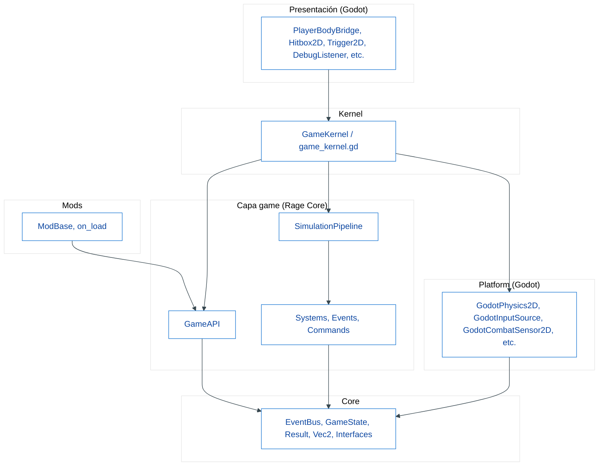
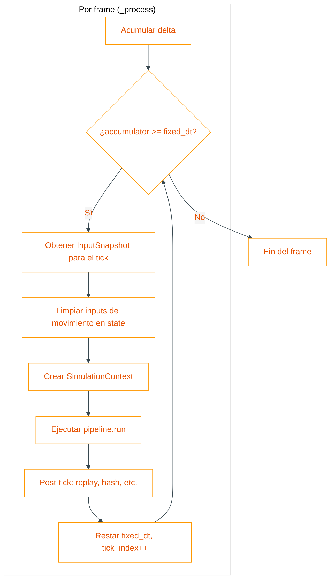
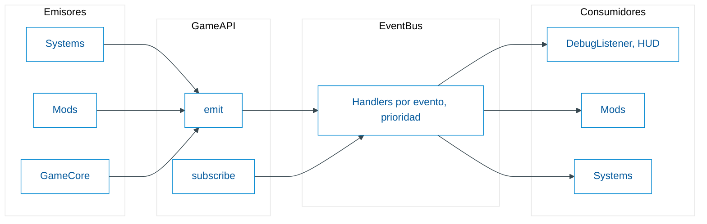
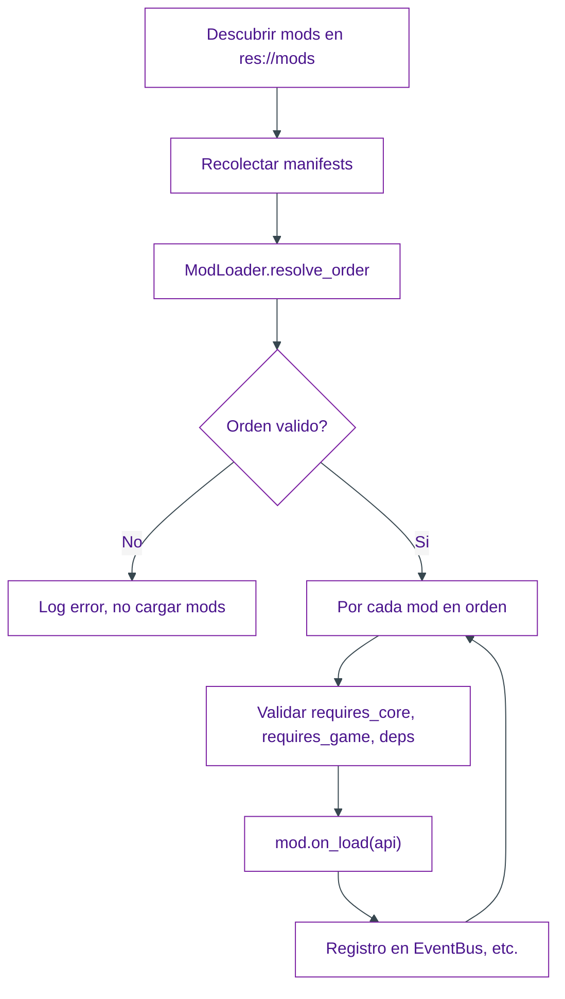
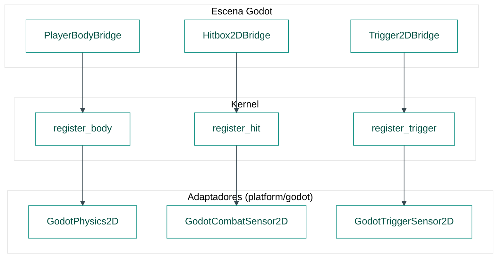

# Arquitectura de Rage Core

Documentación de la arquitectura en capas del framework y flujos principales. Los diagramas usan fondo claro para correcta visualización en GitHub.

---

## 1. Visión general

Rage Core organiza el juego en **capas** para:

- Mantener la lógica de juego **independiente del motor** (Godot).
- Hacer las reglas **deterministas** y testeables.
- Permitir que el contenido evolucione por **mods** sin tocar código base.
- Concentrar toda la integración con Godot en **adaptadores** y **bridges**.

### Reglas de dependencia

| Capa | Puede depender de |
|------|-------------------|
| **core** | Nada (tipos puros, sin Godot) |
| **game** (en rage_core) | core |
| **mods** | Solo GameAPI (facade) |
| **platform/godot** | Godot + interfaces del core/game |
| **presentation** | Godot + kernel (nodos que conectan escena ↔ kernel) |
| **kernel** | Todas (ensambla todo) |

El **kernel del proyecto** (`res://game/game_kernel.gd`) extiende `GameKernel` y es el único **composition root**: registra sistemas, carga mods y packs, y ejecuta el bucle de simulación.

---

## 2. Diagrama de capas y dependencias

El siguiente diagrama muestra la dirección de las dependencias. Las flechas van de “quien depende” hacia “de quien depende”. Fondo claro para lectura en GitHub.

**Resumen**: `presentation` → `kernel` → (`game`, `mods`, `platform`) → `core`. El core y la capa game del addon no conocen Godot.

---

## 3. Arranque (boot)

Flujo de inicialización del kernel en `_ready()`: creación de adaptadores, pipeline, API, carga de contenido y mods.

```mermaid
%%{init: {'theme':'base', 'themeVariables': {'primaryColor':'#e8f5e9','primaryTextColor':'#1b5e20','primaryBorderColor':'#388e3c','lineColor':'#37474f','secondaryColor':'#f5f5f5','tertiaryColor':'#ffffff','background':'#ffffff','mainBkg':'#ffffff','textColor':'#212121'}}}%%
flowchart LR
    A[_ready] --> B[Crear Logger, FileStore, Clock, RNG]
    B --> C[Replay: modo y seed]
    C --> D[EventBus, GameState, GameCore]
    D --> E[InputRegistry, ContentRegistry]
    E --> F[GodotPhysics2D, CombatSensor, TriggerSensor]
    F --> G[GameAPI]
    G --> H[SimulationPipeline]
    H --> I[Proyecto: registrar sistemas en pipeline]
    I --> J[Cargar content packs]
    J --> K[Cargar mods, validar, on_load]
    K --> L[Boot listo]
```

El **kernel del proyecto** (en `game/game_kernel.gd`) es quien, en su `_ready()`, llama a `super._ready()` y luego registra sus sistemas en `_pipeline`, aplica config (run_config, etc.) y opcionalmente registra cuerpos. Todo lo que depende de Godot se crea en el kernel base; el proyecto solo añade pasos al pipeline y configuración.

---

## 4. Bucle de juego (tick)

Cada frame, `_process(delta)` acumula tiempo y ejecuta tantos **ticks fijos** como correspondan. En cada tick se obtiene un snapshot de input, se crea un `SimulationContext` y se ejecuta el pipeline.

El **contexto** incluye: estado del juego, snapshot de input, adaptadores de física y sensores (combat, trigger), EventBus, ContentRegistry, logger y GameCore. Los sistemas reciben el mismo contexto y un `delta` fijo.

---

## 5. Orden de fases del pipeline

Los sistemas se registran en **fases** y con **prioridad**. El pipeline ordena por fase (en el orden definido en `GameConstants.PHASE_IDS`) y dentro de cada fase por prioridad (mayor primero).

```mermaid
%%{init: {'theme':'base', 'themeVariables': {'primaryColor':'#fce4ec','primaryTextColor':'#880e4f','primaryBorderColor':'#ad1457','lineColor':'#37474f','secondaryColor':'#f5f5f5','tertiaryColor':'#ffffff','background':'#ffffff','mainBkg':'#ffffff','textColor':'#212121'}}}%%
flowchart LR
    subgraph phase_input["phase.input"]
        I1[PlayerInputSystem]
        I2[AISystem]
        I3[TriggerBufferSystem]
    end

    subgraph phase_movement["phase.movement"]
        M1[Movement2DSystem]
    end

    subgraph phase_gameplay["phase.gameplay"]
        G1[CombatSystem]
        G2[HealthSystem]
        G3[RoomCombatSystem]
        G4[PickupSystem]
        G5[SurfaceSystem]
    end

    subgraph phase_post["phase.post"]
        P1[LevelSelectionSystem]
        P2[ShopOfferSystem]
        P3[RunEndSystem]
    end

    phase_input --> phase_movement
    phase_movement --> phase_gameplay
    phase_gameplay --> phase_post
```

Cada caja es una fase; dentro de ella el orden depende de la prioridad con la que se registró cada sistema. El proyecto decide qué sistemas registrar y en qué fase/prioridad.

---

## 6. Flujo de eventos (EventBus)

Los mods y sistemas se comunican por **eventos**: suscripción vía `GameAPI.subscribe()` y emisión vía `GameAPI.emit()`. El EventBus reparte los eventos a los handlers (con prioridad y opción de intercepción/cancelación).

Los IDs de eventos están en `GameConstants`; los mods pueden usar prefijos `game.*` o `mod.*`. La lógica de juego no depende de Godot; solo del estado y de los eventos.

---

## 7. Carga de mods

El kernel descubre scripts de mods en `res://mods`, obtiene sus manifests, resuelve el orden (dependencias y versión) y llama a `on_load(api)` en ese orden.

Los mods solo usan `GameAPI`; no acceden a platform ni a nodos de Godot. Así se mantiene la estabilidad del core y la compatibilidad entre versiones.

---

## 8. Conexión con Godot (bridges y adaptadores)

La integración con Godot se hace en dos sitios:

- **platform/godot**: implementaciones de interfaces (input, física, sensores, logger, etc.) que traducen llamadas del core a APIs de Godot.
- **presentation**: nodos de escena que registran cuerpos, hits y triggers en el kernel, o que se suscriben a eventos para la UI.

Los sistemas del core leen hits y triggers desde los sensores (por ejemplo en cada tick); no acceden a nodos. Así la arquitectura se mantiene limpia y testeable.

---

## 9. Referencias rápidas

| Documento | Contenido |
|----------|-----------|
| [addons/rage_core/README.md](../addons/rage_core/README.md) | Detalle del addon Rage Core, estructura de carpetas, contrato de mods |
| [addons/rage_toolkit/README.md](../addons/rage_toolkit/README.md) | CLI, dock, plantillas, metaprogramación |
| [addons/rage_toolkit/MULTI_GAME_PRODUCTION.md](../addons/rage_toolkit/MULTI_GAME_PRODUCTION.md) | Flujo para producir muchos juegos |
| [addons/rage_toolkit/CLI.md](../addons/rage_toolkit/CLI.md) | Comandos de scaffolding |
| [addons/rage_core/docs/REPLAY.md](../addons/rage_core/docs/REPLAY.md) | Replay determinista |

Los diagramas de este archivo están en Mermaid con tema de fondo claro para que las letras se vean bien en GitHub.
